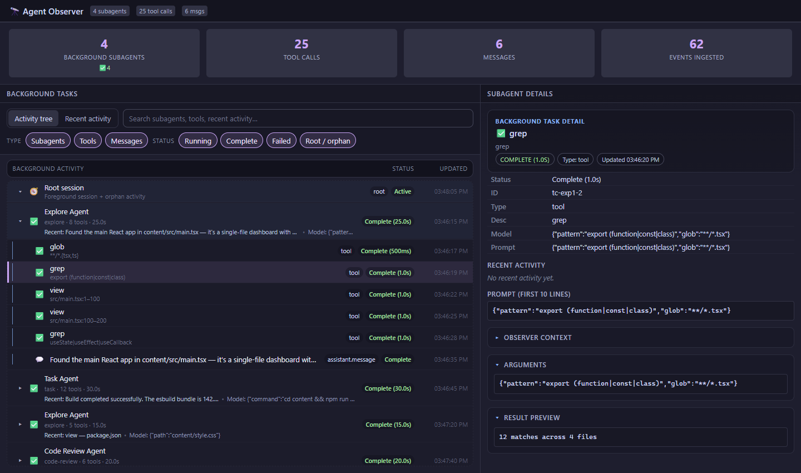
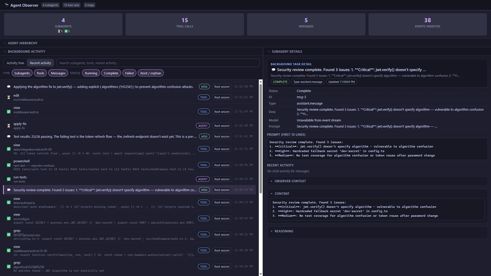
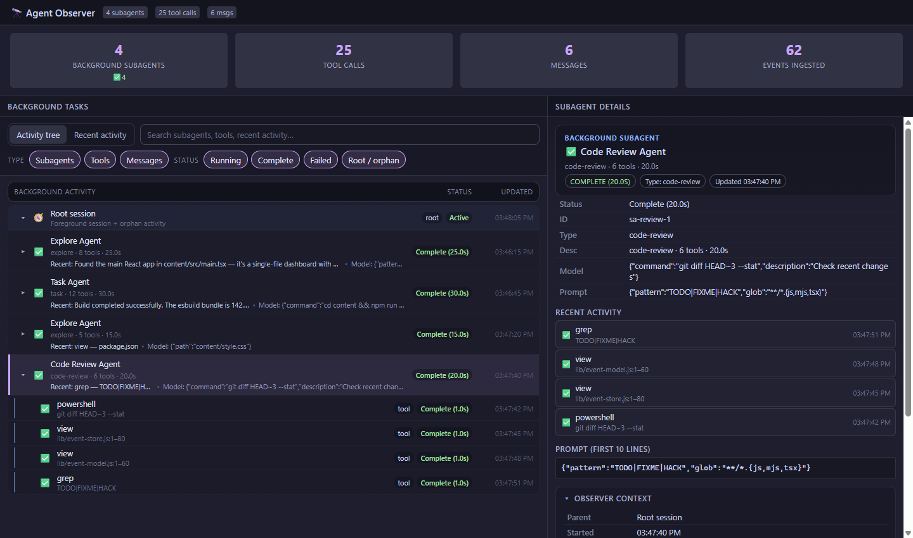
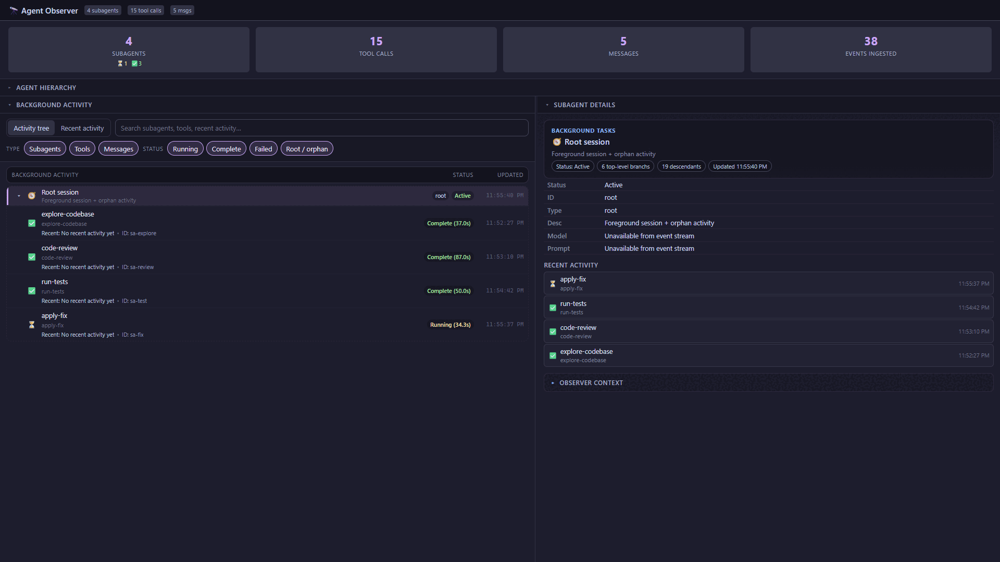

# Copilot CLI Agent Observer

**Real-time observability for GitHub Copilot CLI agent sessions.**

See what your AI agents are actually doing — every tool call, every subagent spawn, every message — in a live native dashboard that runs alongside your terminal.

<!-- TODO: Replace with captured hero screenshot after internal rename -->


---

## The problem

GitHub Copilot CLI is powerful, but its multi-agent architecture is opaque. When the main agent delegates work to explore agents, task agents, or general-purpose subagents, you have no visibility into:

- Which subagents were spawned and why
- What tools each agent called, with what arguments, and what came back
- How long each step took
- Whether the agent is stuck, looping, or making progress

The terminal shows you the final answer. Agent Observer shows you the whole journey.

## Origin

This project started as a response to [github/copilot-cli#1322](https://github.com/github/copilot-cli/issues/1322) — the need for parent-session observability when working with subagents. It has since grown into a general-purpose agent execution inspector covering the main session, all subagent types, tool calls, and message flows.

## Alpha scope

This is an **alpha release** focused on **read-only observability**:

- ✅ Live execution tree showing main agent → subagents → tool calls
- ✅ Chronological activity timeline with tool badges and agent labels
- ✅ Detail inspection pane (arguments, results, timing)
- ✅ Stats cards (agent count, tool call count, message count)
- ✅ Native desktop window (not a browser tab — a real OS window)
- ✅ Auto-connects to the active Copilot CLI session
- ❌ No write operations (cannot modify agent behavior)
- ❌ No persistent storage or export (live session only)

---

## Prerequisites

| Requirement | Details |
|---|---|
| **GitHub Copilot CLI** | Installed and working (`copilot` command available) |
| **Experimental features** | Run `/experimental on` in a Copilot CLI session to enable plugin/extension support |
| **Node.js** | v18+ (ships with Copilot CLI, but required for extension bootstrap) |
| **Platform** | Windows (x64), macOS (arm64/x64), Linux (x64). Native webview support varies — see [Compatibility](#compatibility) |

## Install

### Option 1: Plugin install (recommended)

From any Copilot CLI session:

```
/plugin install <owner>/agent-observer
```

This clones the repo into your Copilot CLI extensions directory and runs bootstrap automatically on next session start.

### Option 2: Manual install

Clone into the Copilot CLI extensions directory:

```bash
# Find your extensions directory (typically ~/.copilot/extensions/ or similar)
cd <copilot-extensions-dir>

git clone https://github.com/<owner>/agent-observer.git
```

The extension self-bootstraps on first load — it runs `npm install` automatically if dependencies are missing.

---

## What happens on first load

When Copilot CLI starts a session with the extension installed:

1. **Bootstrap** — the extension checks for `node_modules/` and runs `npm install` if needed (first run only, takes a few seconds)
2. **Session attach** — the observer wires into the active session's event stream, capturing all agent and tool activity
3. **Ready** — tools and commands are registered; the observer is silently collecting data in the background

No window opens automatically. You choose when to look.

## Usage

### Open the observer window

Use the slash command in any Copilot CLI session:

```
/agent-observer
```

Or ask the agent directly:

> "Open the agent observer"

The agent has access to the `agent_observer_show` tool, so natural-language requests work too.

### Available tools

| Tool | Description |
|---|---|
| `agent_observer_show` | Open the observer window (or bring it to front) |
| `agent_observer_eval` | Run JavaScript in the observer window (for debugging/scripting) |
| `agent_observer_close` | Close the observer window |
| `observer_dump_summary` | Return a structured JSON summary of all captured events (useful in agent conversations) |

### Reading the dashboard

<!-- TODO: Replace with captured screenshots after internal rename -->

**Execution tree** — hierarchical view showing Root Session → Subagents → Tool Calls / Messages. Expand any node to drill into its children.



**Activity timeline** — chronological feed of all events with tool-type badges, agent attribution, and result previews.

**Detail pane** — click any node or timeline row to inspect full arguments, results, timestamps, and agent context.



<!-- TODO: Add demo walkthrough GIF when captured -->
<!--  -->

---

## Build & development

The extension has two layers that need separate attention:

### Extension runtime (Node.js)

The extension entry point and event store are plain `.mjs` files — no build step needed.

```bash
cd .github/extensions/agent-observer/
npm install          # Install runtime dependencies (@webviewjs/webview, ws)
```

### UI (React + TypeScript)

The dashboard UI is a React app bundled with esbuild:

```bash
cd .github/extensions/agent-observer/content/
npm install          # Install React, esbuild
npm run build        # One-shot production build → dist/main.js
npm run watch        # Rebuild on file changes (dev mode)
```

After rebuilding, reload the observer window to pick up changes (close and reopen, or use `agent_observer_show` with `reload: true`).

### Project structure

```
.github/extensions/agent-observer/
├── extension.mjs          # Bootstrap entry (npm install if needed, then loads main)
├── main.mjs               # Extension logic: session wiring, tools, commands
├── package.json            # Runtime deps (@webviewjs/webview, ws)
├── lib/
│   ├── copilot-webview.js  # Reusable webview host (HTTP server + WebSocket bridge)
│   ├── event-model.js      # Normalized event data model
│   ├── event-store.js      # Event store with buffered startup merge
│   └── webview-child.mjs   # Native window child process
└── content/
    ├── src/main.tsx        # React dashboard source
    ├── style.css           # Dashboard styles
    ├── dist/main.js        # Built bundle (committed)
    └── package.json        # UI build deps (react, esbuild)
```

---

## Compatibility

The native window is powered by [`@webviewjs/webview`](https://github.com/webviewjs/webview), which uses platform-native webview engines:

| Platform | Webview engine | Status |
|---|---|---|
| **Windows** (x64) | WebView2 (Edge/Chromium) | ✅ Fully supported |
| **macOS** (arm64/x64) | WKWebView (Safari) | ✅ Fully supported |
| **Linux** (x64) | WebKitGTK | ⚠️ Requires `libwebkit2gtk-4.0` installed |
| **Other** | — | ❌ Not supported |

### Known limitations

- **Alpha quality** — expect rough edges, especially around session transitions and edge-case event types
- **Read-only** — the observer cannot influence agent behavior; it is a passive listener
- **Single session** — observes one Copilot CLI session at a time; switching sessions resets the view
- **No persistence** — closing the window or ending the session discards all captured data
- **WebSocket bridge** — the UI connects to the extension via a local WebSocket; firewalls or security software that block localhost connections may interfere
- **Linux webview** — requires GTK/WebKit system libraries that may not be present on minimal or server distros

---

## Acknowledgements

This project builds on the **copilot-webview-creator** pattern by [Steve Sanderson](https://github.com/SteveSandersonMS/copilot-webview-creator), which demonstrated how to give Copilot CLI extensions native desktop windows using `@webviewjs/webview`. The webview hosting layer (`lib/copilot-webview.js`) is derived from that work.

The native webview runtime is provided by the [`@webviewjs/webview`](https://github.com/webviewjs/webview) project.

## License

[MIT](LICENSE) — see LICENSE file for full text.
